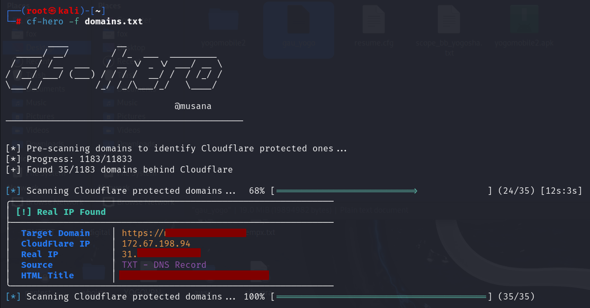
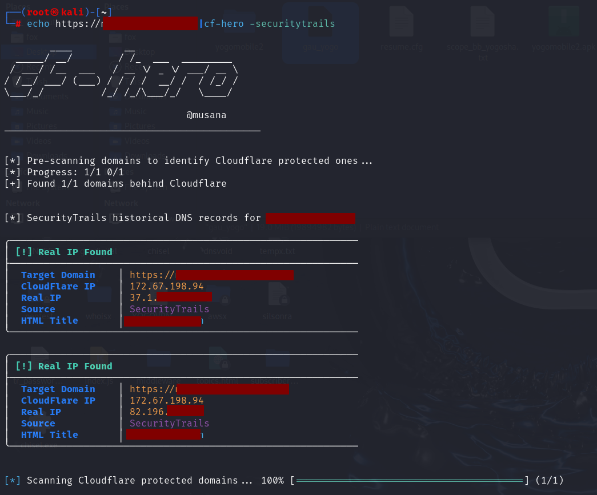

## CF-Hero

<h1 align="center">
  CF-Hero
  <br>
</h1>

<p align="center">
  <a href="https://www.blackhat.com/asia-24/arsenal/schedule/#cf-hero-37767"></a>
  <a href="https://pkg.go.dev/github.com/musana/cf-hero"></a>
  <a href="https://goreportcard.com/report/github.com/musana/cf-hero"></a>
  <a href="https://opensource.org/licenses/MIT"></a>
  <a href="https://twitter.com/musana"></a>


</p>

<p align="center">
  <a href="#whats-it">What's it?</a> •
  <a href="#feautures">Features</a> •
  <a href="#background">Background</a> •
  <a href="#installation-instructions">Installation</a> •
  <a href="#usage">Usage</a> •
  <a href="#running-cf-hero">Running cf-hero</a> •
  <a href="#-sponsorship">ZoomEye (Sponsor)</a> •
  <a href="#to-do">To Do</a>
</p>

<p height="300" align="center">
  
</p>

# What's it?
CF-Hero is a comprehensive reconnaissance tool developed to discover the real IP addresses of web applications protected by Cloudflare. It performs multi-source intelligence gathering through various methods.

### DNS Reconnaissance
- Current DNS records (A, TXT)
- Historical DNS data analysis
- Associated domain discovery

### Intelligence Sources
- ZoomEye search engine
- Censys search engine
- Shodan search engine
- SecurityTrails historical records
- Active DNS enumeration
- Related domain correlation

The tool analyzes data from these sources to identify potential origin IP addresses of Cloudflare-protected targets. It validates findings through response analysis to minimize false positives.

**a simple flowchart of the tool**

```
┌──────────┐                                                                                             
│          │        ┌─────────┐                                                                          
│  Domain  │───────►│ Check A │                                                                          
│          │        │ Records │                                                                          
└──────────┘        └────┬────┘                                                                          
                         │                                                                               
      ┌──────────────────┘                                                                               
      │                                                                                                  
      ▼                                                                                                  
┌────────────┐                                                                                           
│ Is it bend │                YES                                                                        
│  CloudFle  ├───────────────────────────────────────────┐                                               
└────────────┘                                           │                                               
      │                                                  │                                               
      │                                                  │                                               
      │                                                  ▼                                               
      │                                     ┌──────────────────────────┐                                 
      │                                     │  Check the domain from   │                                 
      │                   ┌─────────────────│      various sources     │───────────────────┐             
      │                   │                 └─┬────────────────────────┘                   │             
      │                   │                   │                      │                     │             
      │                   │                   │                      │                     │             
      │                   │                   │                      │                     │             
      │                   ▼                   ▼                      ▼                     ▼             
      │           ┌────────────────┐       ┌─────────────┐        ┌───────────┐      ┌─────────────┐     
      │           │ Historical DNS │       │ Current DNS │      ┌─┤   OSINT   │      │ Sub/domains │     
      │        ┌──│    Records     │     ┌─│   Records   │      │ └───────────┘    ┌─│             │     
      │        │  └────────────────┘     │ └─────────────┘      │   ┌─────────┐    │ └─────────────┘     
      │        │    ┌──────────────┐     │   ┌────────────┐     ├──►│ ZoomEye │    │   ┌─────────────┐   
      │        ├───►│SecurityTrails│     ├──►│ TXT        │     │   └─────────┘    │   │ sub(domains)│   
      │        │    └──────────────┘     │   └────────────┘     │   ┌─────────┐    └──►│ used by the │   
      │        │    ┌──────────────┐     │   ┌────────────┐     ├──►│ Shodan  │        │ same company│   
      │        └───►│Completedns   │     └──►│ A          │     │   └─────────┘        └─────────────┘  │
      │     │       └──────────────┘         └────────────┘     │   ┌─────────┐                         │
      │     │                                                   └──►│ Censys  │                         │
      │     │                                                       └─────────┘                         │
      │     │                                                                                           │
      │     │                                                                                           │
      │     └───────────────────────────────────────────┬───────────────────────────────────────────────┘
      │                                                 │                                                
   NO │                                                 │                                                
      │                                                 │                                                
      │                                                 │                                                
      │                                                 ▼                                                
      │                               ┌──────────────────────────────────────┐                           
      │                               │ Establish direct HTTP connections to │                           
      │                               │       each discovered IP address     │                           
      │                               └──────────────────────────────────────┘                           
      │                                                 │                                                
      │                                                 │                                                
      │                                                 │                                                
      │                                                 ▼                                                
      │                                   ┌─────────────────────────────┐                                
      │                                   │ Compare the HTML title with │                                
      │                                   │      the target's title     │                                
      │                                   └─────────────────────────────┘                                
      │                                                 │                                                
      │                                                 │                                                
      │                                                 │                                                
      │                                                 ▼                                                
      │                                       ┌─────────────────────┐                                    
      │                                       │                     │       YES                          
      │                                       │ Are they the same ? │─────────────────────┐              
      │                                       │                     │                     │              
      │                                       └─────────────────────┘                     ▼              
      │                                                 │                          ┌───────────────┐     
      │                                                 │NO                        │ Real IP found │     
      │                                                 │                          └───────┬───────┘     
      │                                                 ▼                                  │             
      │                                            ┌──────────┐                            │             
      └───────────────────────────────────────────►│  FINISH  │◄───────────────────────────┘             
                                                   └──────────┘                                          

```

# Feautures
### Features

- DNS Reconnaissance
  - Checks current DNS records (A, TXT)
  - Extracts domains behind Cloudflare
  - Extracts domains not behind Cloudflare

- Third-party Intelligence
  - ZoomEye integration
  - Censys integration
  - Shodan integration
  - SecurityTrails integration
  - Reverse IP lookup for associated domains

- Advanced Features
  - Custom JA3 fingerprint support
  - Concurrent scanning capabilities
  - Standard input support (piping)
  - HTML title comparison for validation
  - Proxy support
  - Custom User-Agent configuration

# Background
## Current DNS Records
Let's take look at some use-case with misconfigured DNS settings. 

As you can see, a regular DNS query returns the IP address of the domain. For example, musana.net is behind Cloudflare (CF), but sometimes the domain has multiple A records, and some of them may not correspond to IP addresses associated with CF. (This DNS output is merely an illustrative example and may not represent the exact DNS answer for musana.net.)

```
;; ANSWER SECTION:
musana.net.	300	IN	A	104.16.42.102
musana.net.	300	IN	A	104.16.43.102
musana.net.	300	IN	A	123.45.67.89 (Real IP exposed)
musana.net.	300	IN	A	123.45.76.98 (Real IP exposed)
```

The another case is related to TXT records. Sometimes domain is behind of CF but real IP of the domain may used in TXT records. CF-Hero check all TXT records then extract all IP address finally it try to connect IP which it found via HTTP.

Let's say we have like DNS TXT records. As seen in the TXT records, there is SPF record. Some company can host own mail server and TXT records may contain IP which points to target domain.

As you can see in the following DNS answer SPF record has some IP addresses. Cf-Hero also checks these.

```
;; ANSWER SECTION:
musana.net.	115	IN	TXT	"1password-site-verification=LROK6G5XFJG5NF76TE2FBTABUA"
musana.net.	115	IN	TXT	"5fG-7tA-G4V"
musana.net.	115	IN	TXT	"MS=ms16524910"
musana.net.	115	IN	TXT	"OSSRH-74956"
musana.net.	115	IN	TXT	"docker-verification=6910d334-a3fc-419c-89ac-57668af5bf0d"
musana.net.	115	IN	TXT	"docusign=4c6d27bb-572e-4fd4-896c-81bfb0af0aa1"
musana.net.	115	IN	TXT	"shopify-verification-code=1Ww5VsPpkIf32cJ5PdDHdguRk22K2R"
musana.net.	115	IN	TXT	"shopify-verification-code=NM243t2faQbaJs8SRFMSEQAc4J9UQf"
musana.net.	115	IN	TXT	"v=spf1 include:_spf.google.com include:cust-spf.exacttarget.com include:amazonses.com include:mail.zendesk.com include:servers.mcsv.net include:spf.mailjet.com ip4:216.74.162.13 ip4:216.74.162.14  ip4:153.95.95.86 ip4:18.197.36.5 -all"


```

## OSINT

OSINT is another technique to find real IP of any domain which is behind of CF. There are lots of special search engine for special purpose. Shodan and Censys are two of these. They provide more detail and technical information.  These search engine scan whole internet continously and discover new assets or monitor and log changing in assets. When a domain which is not behind of CF get up, bot of these engine can log Real IP of the domain. After a while if the domain will take behind of cloudflare, their IP can be found using these search engine.

CF-Hero checks censys and shodan too. (Note that when you use these services you have some limit due to API quota.)


## (Sub)Domains
The other trick way is (sub)domain technique. Actually It doesn't have to be a subdomain It can be domain as well. The key point is here; domains should belong to same company.

Let's say we have 2 domain. One of them is behind of CF but the otner is not. In this case, you connect to the domain which is not behind of CF then you change host header with domain which is behind of CF. If you get response of application's which is behind of CF, congruculations you bypassed CF. You can access web application from IP directly anymore. (and of course that's also depends on the configuration)


Let's take look at closer


```

--> TCP --> blog.musana.net [123.45.67.89] ---> HTTPs -------------\
                                                                    \
--> TCP --> api.musana.net [123.67.45.98] ----> HTTPs -----------\   \ 
                                                                  \   \
--> TCP --> test.musana.net [123.89.44.88] ---> HTTPs -------------\   \
                                                                    \___\____________________
--> TCP --> tools.musana.net [123.44.55.66] --> HTTPs -------------> | GET / HTTP/2          |
                                                                     | Host: musana.net      | ====> Check & Compare Responses
--> TCP --> admin.musana.net [33.44.123.45] --> HTTPs -------------->|_______________________|
                                                                          /    /
--> TCP --> ... [...] ------------------------> HTTPs ------------------>/    /
                                                                        /    /
--> TCP --> ... [...] ------------------------> HTTPs ---------------->/    /
                                                                      /    /
--> TCP --> random-test.com [55.44.11.33] ----> HTTPs -------------->/    /
                                                                         /
--> TCP --> fsubsidiary.net [66.77.22.123] ---> HTTPs ----------------->/


```


## Historical DNS Records
Historical DNS records services try to discover all domains on the Internet and record changes in the DNS records of these domains.The best known of these services is securitytrails. If a domain is published on internet with its real IP address these service's bot can log it's real IP address after then if the domain is taken behind of cloudflare, the real IP addresses can find out using these services. Thus, we can find the real ip address of a domain that has broadcast over the real ip address in the past.

It uses the security trails service for historical DNS records. You can perform this scan using the `-securitytrails` parameter after entering the API key in the cf-hero.yaml file.


# Installation Instructions

cf-hero requires **go1.18** to install successfully. Run the following command to install.

```
go install -v github.com/musana/cf-hero/cmd/cf-hero@latest
```

# Usage

```

        ____         __
  _____/ __/        / /_  ___  _________
 / ___/ /__  ___   / __ \/ _ \/ ___/ __ \
/ /__/ ___/ (___) / / / /  __/ /  / /_/ /
\___/_/          /_/ /_/\___/_/   \____/

                                @musana
_____________________________________________

Unmask the origin IPs of Cloudflare-protected domains

Usage:
  cf-hero [flags]

Flags:
GENERAL OPTIONS:
   -w int     Worker count (default 16)
   -f string  Input file containing list of host/domain

PRINT OPTIONS:
   -cf      Print domains behind of Cloudflare
   -non-cf  Print domains not behind of Cloudflare

SOURCES:
   -censys          Include Censys in scanning
   -securitytrails  Include SecurityTrails historical DNS records in scanning
   -shodan          Include Shodan historical DNS records in scanning
   -dl string       Domain list for sub/domain scanning
   -td string       Target domain for sub/domain scanning

CONFIGURATION:
   -hm string   HTTP method. (default "GET")
   -ja3 string  JA3 String (default "772,4865-4866-4867-49195-49199-49196-49200-52393-52392-49171-49172-156-157-47-53,18-10-16-23-45-35-5-11-13-65281-0-51-43-17513-27,29-23-24,0")
   -ua string   HTTP User-Agent (default "Mozilla/5.0 (Macintosh; Intel Mac OS X 10.15; rv:109.0) Gecko/20100101 Firefox/113.0")
   -px string   HTTP proxy URL


```


# Running CF-Hero
The most basic running command. It checks A and TXT records by default.

```
# cat domains.txt | cf-hero
```

or you can pass "f" parameter to it.
```
# cf-hero -f domains.txt
```

Use the **censys** parameter to include Shodan in the scan
```
# cat domain.txt | cf-hero -censys
```

Use the **shodan** parameter to include Shodan in the scan
```
# cat domain.txt | cf-hero -shodan
```

Use the **securitytrails** parameter to include Shodan in the scan
```
# cat domain.txt | cf-hero -securitytrails
```

Use the -td and -dl parameters to attempt to find the target domain's IP address by utilizing a list of domains or subdomains that are not behind Cloudflare. By specifying the IP addresses in the blocks where you have identified live IP addresses used by the target's cloud or on-premises infrastructure with the -dl parameter, you can find the real IP address of the target domain
```
# cf-hero -td https://musana.net -dl sub_domainlist.txt
```

to get domains behind of CF

```
# cf-hero -f domains.txt -cf
```

to get domains not behind of CF

```
# cf-hero -f domains.txt -non-cf
```

other options (custom ja3, proxy, worker, user agent)

```
# cf-hero -d https://musana.net -ua "Mozilla" -w 32 -ja3 "771,22..." -px "http://127.0.0.1:8080"
```

create cf-hero.yaml file under $HOME/.config/ directory to set censys API key
```
# touch ~/.config/cf-hero.yaml

// content of YAML file should be like;

securitytrails:
  - "api_key_here"
shodan:
  - "api_key_here"
censys:
  - "api_key_here"

```

## SS
<p align="left">
  
</p>

<p align="left">
  
</p>

## 🏆 Sponsorship  
This project is proudly supported by [ZoomEye](https://www.zoomeye.ai).  

<p height="100" align="left">
  <a href="https://www.zoomeye.ai"></a>
</p>

## To Do
- JA3 Randomization. (In some cases, Cloudflare blocks the JA3 hash of libraries used for automation/scanning purposes at the TLS layer. This feature is designed to bypass that protection. You can currently provide a custom JA3 string to bypass this protection.)
- A more effective technique will be added to determine if two HTTP responses are the same.
